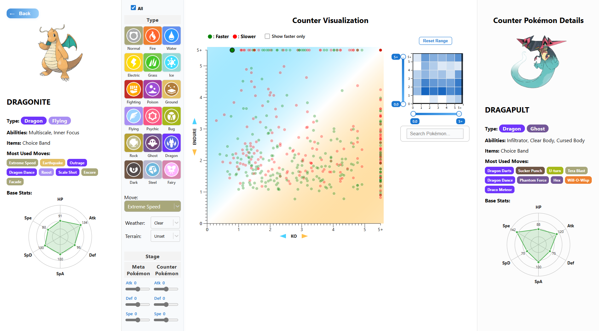
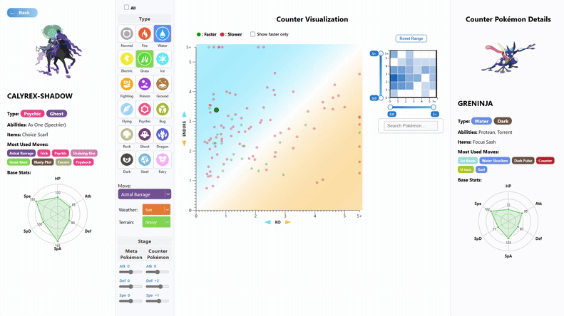
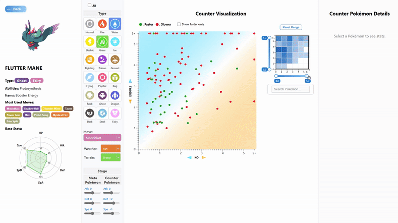

# 🧠 Pokémon Battle Matchup Visualizer  
**실전 배틀 데이터를 기반으로 한 포켓몬 상성 분석 시각화 도구**

## 📌 프로젝트 소개
이 프로젝트는 **Smogon**에서 제공하는 실전 데이터를 기반으로,  
포켓몬 간의 **전투 상성을 시각적으로 분석**할 수 있는 웹 기반 도구입니다.

- 메타 포켓몬의 사용률 확인
- 포켓몬 간 유불리 관계 시각화
- 스피드/내구/화력 기반 상성 분석
- 사용자가 직접 조건(날씨, 필드, 기술 등)을 조정하여 맞춤형 분석 가능

## 🚀 주요 기능

### 1. 사용률 시각화
- 실전 랭크 배틀에서의 포켓몬 사용률 데이터를 수집
- 수평 막대 그래프(Horizontal Bar Graph)로 메타 포켓몬 확인 가능

### 2. 포켓몬 상세 정보 조회
- 클릭 시 해당 포켓몬의 **타입, 특성, 도구, 기술, 스탯(Radar Chart)** 제공

### 3. Scatter Plot 기반 상성 분석
- **X축**: 내가 상대를 기절시키는 데 필요한 횟수
- **Y축**: 상대가 나를 기절시키는 데 필요한 횟수
- 색상: 스피드 우위 (초록: 빠름 / 빨강: 느림)
- 배경: 유불리 Gradient

### 4. Zoomable 히트맵 + 미니맵
- 전체 분포 히트맵 제공
- Zoom & Pan 기능으로 관심 영역만 탐색 가능

### 5. 실시간 필터링 & 인터랙션
- 타입, 스피드, 날씨, 필드, 랭크, 기술 등 다양한 조건 필터링
- 검색 기능, 호버 시 툴팁, 클릭 시 상세 분석 지원

### 실행하는 방법
1. npm install 명령어를 통해 필요한 package들을 node_modules 폴더에 받아온다
2. 터미널에서 npm run dev 명령어를 통해 웹페이지를 실행시키고, 거기에 뜨는 URL을 Ctrl+좌클릭을 통해 실행시킨다
